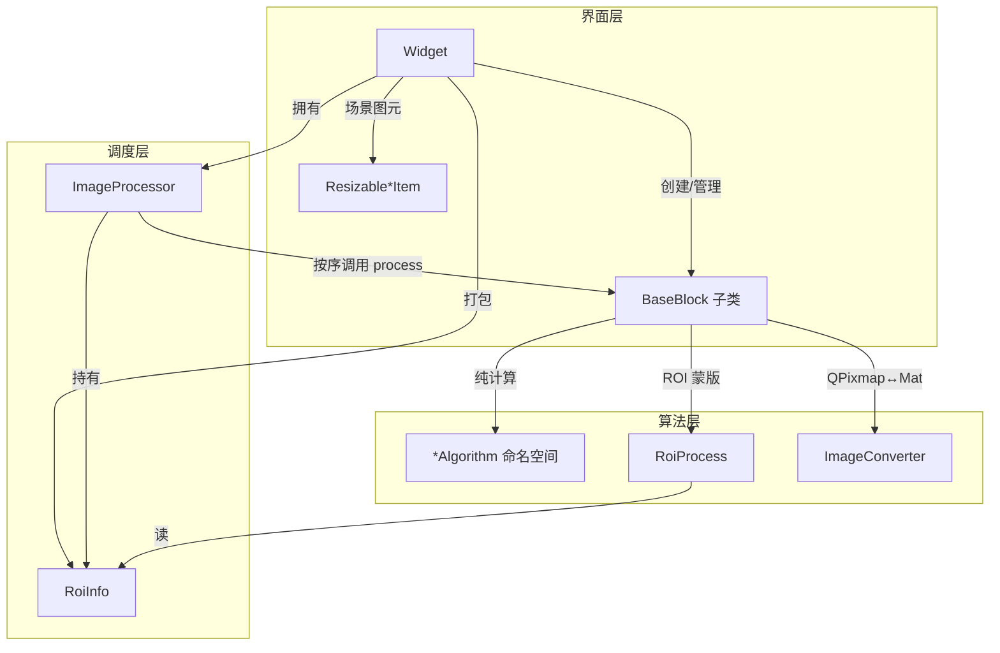
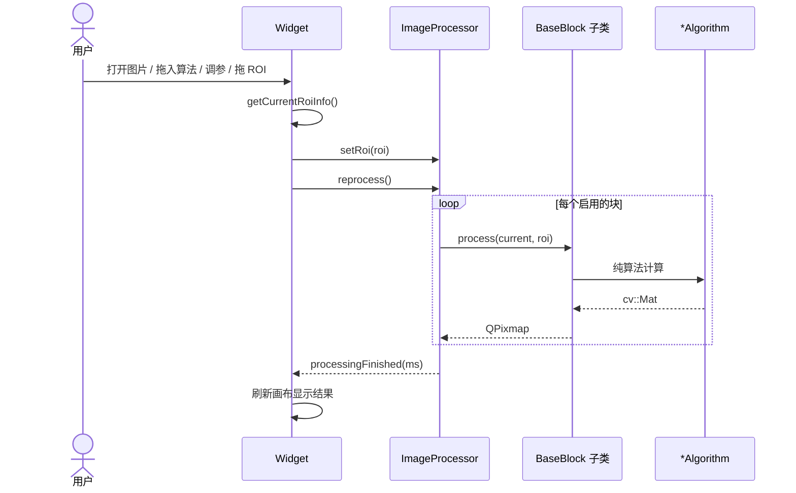

# 图像处理工具 — 类图

> 根据当前源码结构整理，便于对照阅读。

---

## 1. 总览类图

```mermaid
classDiagram
    direction TB

    %% ========== 入口 / 主界面 ==========
    class QApplication
    class StyleLoader {
        <<namespace>>
        +loadAppStyle() QString$
    }

    class QWidget
    class Widget {
        -Ui::Widget* ui
        -QGraphicsScene* m_scene
        -QGraphicsPixmapItem* m_pixmapItem
        -ImageProcessor* m_processor
        -QList~BaseBlock*~ m_blockList
        -ResizableRectItem* m_rectItem
        -ResizableEllipseItem* m_ellipseItem
        -ResizableRotatedRectItem* m_rotatedRectItem
        -QTimer* m_roiUpdateTimer
        +onApplyProcessing()
        +loadImageFromPath(path) bool
        -createBlockByName(name)
        -getCurrentRoiInfo() RoiInfo
    }

    class MyListWidget {
        +mimeData() QMimeData*
    }
    class QListWidget
    MyListWidget --|> QListWidget
    Widget --|> QWidget
    Widget --> ImageProcessor : 拥有 / 调度
    Widget --> MyListWidget : 左侧算法列表
    Widget o-- "0..1" ResizableRectItem
    Widget o-- "0..1" ResizableEllipseItem
    Widget o-- "0..1" ResizableRotatedRectItem
    Widget o-- "*" BaseBlock : m_blockList
    StyleLoader ..> QApplication : setStyleSheet

    %% ========== 处理引擎 ==========
    class ImageProcessor {
        -QPixmap m_original
        -QPixmap m_result
        -QList~BaseBlock*~ m_blocks
        -RoiInfo m_roi
        +setOriginalImage(pixmap)
        +addBlock(block)
        +removeBlock(block)
        +setRoi(roi)
        +reprocess() qint64
        +originalImage() QPixmap
        +resultImage() QPixmap
    }
    class QObject
    ImageProcessor --|> QObject
    ImageProcessor o-- "*" BaseBlock : 按序 process
    ImageProcessor --> RoiInfo : 持有
    ImageProcessor ..> TimeMeasurer : 计时

    %% ========== 处理块继承 ==========
    class BaseBlock {
        <<abstract>>
        +process(input, roi)* QPixmap
        +blockName()* QString
        +isEnabled() bool
        #setupTitle(icon, title)
        #contentLayout() QVBoxLayout*
        +paramsChanged()
        +removeRequested()
        +enabledChanged(bool)
    }
    BaseBlock --|> QWidget

    class BinarizationBlock {
        -QSpinBox* m_lowerSpin
        -QSpinBox* m_upperSpin
        -QPushButton* m_autoBtn
        +process(input, roi) QPixmap
        +setThresholds(lower, upper)
        +otsuRequested()
    }
    class MorphologyBlock {
        -QComboBox* m_opCombo
        -QSpinBox* m_kxSpin
        -QSpinBox* m_kySpin
        -QSpinBox* m_iterSpin
        +process(input, roi) QPixmap
    }
    class FilterBlock {
        -QComboBox* m_typeCombo
        -QSpinBox* m_kxSpin
        -QSpinBox* m_kySpin
        -QSpinBox* m_iterSpin
        +process(input, roi) QPixmap
    }
    class GrayTransformBlock {
        -QComboBox* m_typeCombo
        -QSpinBox* m_brightSpin
        -QSpinBox* m_contrastSpin
        -QDoubleSpinBox* m_gammaSpin
        +process(input, roi) QPixmap
    }
    class PseudoColorBlock {
        -QComboBox* m_mapCombo
        +process(input, roi) QPixmap
    }

    BinarizationBlock --|> BaseBlock
    MorphologyBlock --|> BaseBlock
    FilterBlock --|> BaseBlock
    GrayTransformBlock --|> BaseBlock
    PseudoColorBlock --|> BaseBlock

    %% ========== ROI ==========
    class RoiInfo {
        <<struct>>
        +Shape shape
        +QRectF rect
        +QPointF center
        +QSizeF size
        +qreal angleDeg
        +isEmpty() bool
        +boundingRect() QRectF
    }
    class Shape {
        <<enumeration>>
        None
        Rect
        Ellipse
        RotatedRect
    }
    RoiInfo --> Shape

    class QGraphicsRectItem
    class QGraphicsEllipseItem
    class QGraphicsObject
    class ResizableRectItem {
        +HandleType
        -getHandleAtPos(pos)
    }
    class ResizableEllipseItem {
        +HandleType
    }
    class ResizableRotatedRectItem {
        +HandleType
        +localRect() QRectF
    }
    ResizableRectItem --|> QGraphicsRectItem
    ResizableEllipseItem --|> QGraphicsEllipseItem
    ResizableRotatedRectItem --|> QGraphicsObject
    Widget ..> RoiInfo : getCurrentRoiInfo 打包

    %% ========== 工具 / 算法命名空间 ==========
    class ImageConverter {
        <<utility>>
        +pixmapToMatRGB(pixmap)$ Mat
        +pixmapToMatGray(pixmap)$ Mat
        +matToPixmap(mat)$ QPixmap
        +imageToMat(image)$ Mat
    }
    class RoiProcess {
        <<namespace>>
        +makeMask(size, roi)$ Mat
        +apply(src, roi, fn)$ Mat
    }
    class TimeMeasurer {
        +TimeMeasurer(label, autoPrint)
        +elapsedMs() qint64
    }
    class AppConfig {
        <<namespace>>
        +BLOCK_NAME_*$
        +DEFAULT_*$
    }

    class BinarizationAlgorithm {
        <<namespace>>
        +applyRangeThreshold()$
    }
    class OtsuAlgorithm {
        <<namespace>>
        +calculateThresholdFromBGR()$
    }
    class MorphologyAlgorithm {
        <<namespace>>
        +apply()$
    }
    class FilterAlgorithm {
        <<namespace>>
        +apply()$
    }
    class GrayTransformAlgorithm {
        <<namespace>>
        +apply()$
    }
    class PseudoColorAlgorithm {
        <<namespace>>
        +apply()$
    }

    BaseBlock ..> RoiInfo : process 参数
    BaseBlock ..> ImageConverter : 格式转换
    BaseBlock ..> RoiProcess : ROI 贴回

    BinarizationBlock ..> BinarizationAlgorithm
    BinarizationBlock ..> OtsuAlgorithm : 经 Widget 间接
    MorphologyBlock ..> MorphologyAlgorithm
    FilterBlock ..> FilterAlgorithm
    GrayTransformBlock ..> GrayTransformAlgorithm
    PseudoColorBlock ..> PseudoColorAlgorithm
    RoiProcess ..> RoiInfo
    Widget ..> AppConfig
```

---

## 2. 分层关系图

---

## 3. 运行时协作（时序简图）

---

## 4. 读图要点

| 关系 | 含义 |
|------|------|
| `Widget → ImageProcessor` | 主窗口拥有引擎，负责同步 ROI 并触发 `reprocess` |
| `ImageProcessor ◇── BaseBlock*` | 处理链：按列表顺序调用 `process` |
| `BaseBlock ◄── 五个子类` | 策略模式：UI 参数 + `process` 实现 |
| `Widget → RoiInfo → 各 Block` | 图元几何 → 纯数据 → 算法 mask |
| `*Block ⋯> *Algorithm` | UI 与 OpenCV 算法分离 |

### 核心继承两条线

1. **处理块**：`QWidget` → `BaseBlock` → 五个具体算法块  
2. **ROI 图元**：`QGraphics*Item` → `Resizable*Item`  

中间用 `RoiInfo` + `ImageProcessor` 把 UI 和算法接起来。

---

## 5. 源码目录对照

| 目录 | 对应类 / 命名空间 |
|------|-------------------|
| `core/` | `Widget`, `ImageProcessor` |
| `blocks/` | `BaseBlock` 及五个子类 |
| `roi/` | `RoiInfo`, `Resizable*Item` |
| `algorithms/` | `*Algorithm` 命名空间 |
| `utils/` | `ImageConverter`, `RoiProcess`, `TimeMeasurer` |
| `config/` | `AppConfig` |
| `styles/` | `StyleLoader` |
| `main.cpp` | 入口：创建 `QApplication` + `Widget` |

---

## 查看方式

- 在 **Cursor / VS Code** 中打开本文件，安装 Mermaid 预览插件即可渲染  
- 或复制到 [Mermaid Live Editor](https://mermaid.live) 查看  
- GitHub / GitLab 对 `.md` 中的 mermaid 代码块也支持直接渲染  
